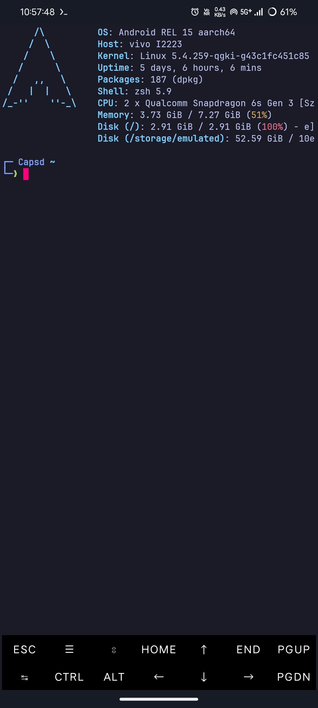
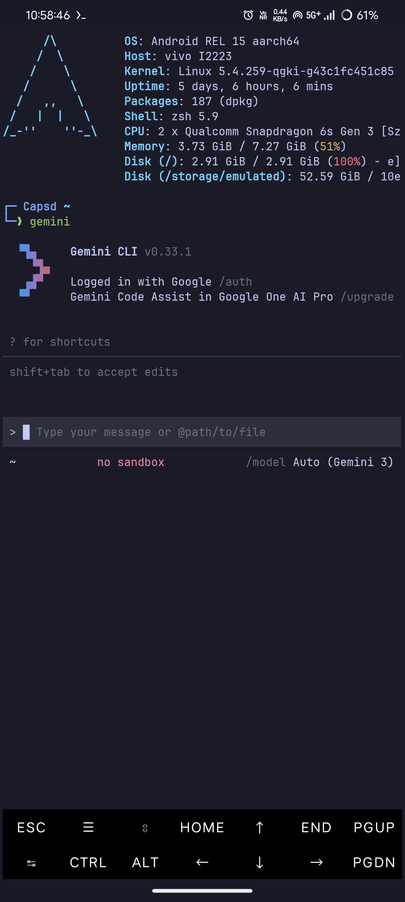
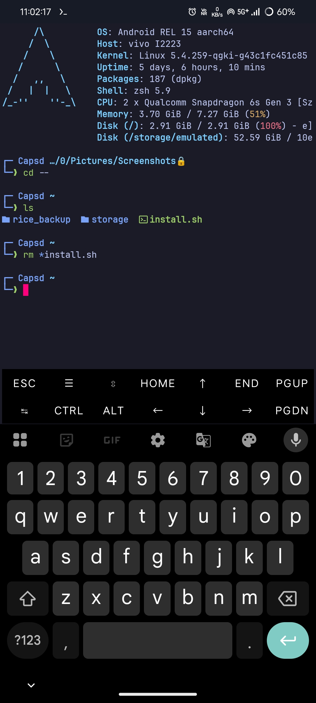

# 🚀 capsd-termux

Transform your default Termux environment into a powerful, stylish, and highly productive mobile terminal. This automated setup script installs a complete Zsh-based environment with modern Rust-based CLI tools, a beautiful custom prompt, and an optimized keyboard layout.

## ✨ Features

* **Zsh & Oh My Zsh:** The ultimate shell framework for productivity.
* **Starship Prompt:** A fast, customizable, and visually striking two-line prompt.
* **Modern Unix Tools:** Replaces legacy commands with faster, colorful alternatives.
* **Smart Navigation:** Fuzzy finding and intelligent directory jumping.
* **Aesthetic UI:** Pre-configured Tokyo Night color palette and a clean `fastfetch` system information display on startup.
* **Optimized Extra Keys:** A custom two-row keyboard layout designed for coding and navigation on mobile screens.

## 🛠️ Tools Included

| Standard Command | Modern Alias / Replacement | Description |
| :--- | :--- | :--- |
| `ls` | `eza` (`ls`, `ll`, `la`, `tree`) | Modern replacement for `ls` with icons and colors. |
| `cat` | `bat` (`cat`) | A `cat` clone with syntax highlighting and Git integration. |
| `cd` | `zoxide` (`z`) | A smarter `cd` command that remembers your habits. |
| *Search* | `fzf` | Command-line fuzzy finder for history and files. |
| *System Info* | `fastfetch` | Fast, customizable system information script. |

> **Note:** The setup automatically configures `zsh-autosuggestions` and `zsh-syntax-highlighting` to make typing commands faster and less error-prone.

## 🚀 Installation

**Warning:** This script will overwrite your existing `.zshrc`, `.config/starship.toml`, and Termux properties files. Back them up first if you have existing configurations you want to keep!

### The One-Liner (Recommended)
You can install and run the entire setup with a single command:

```bash
curl -fsSL https://raw.githubusercontent.com/catamsp/capsd-termux/refs/heads/main/install.sh | bash

```

🎨 Post-Installation & Customization
Once the script finishes, restart Termux for all changes and the default shell swap to take effect.

Custom Fonts (Nerd Fonts)
To see the icons in eza, starship, and fastfetch properly, you need a Nerd Font.
Download a Nerd Font (like FiraCode or Meslo), rename the file to font.ttf, move it to ~/.termux/, and run termux-reload-settings.

📝 Configuration Files
If you want to tweak the setup later, you can find the generated configs here:

Zsh settings: ~/.zshrc

Prompt settings: ~/.config/starship.toml

Color scheme: ~/.termux/colors.properties

Keyboard layout: ~/.termux/termux.properties

### 📸 Screenshots



